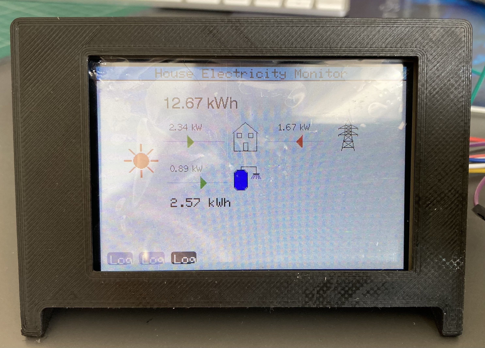
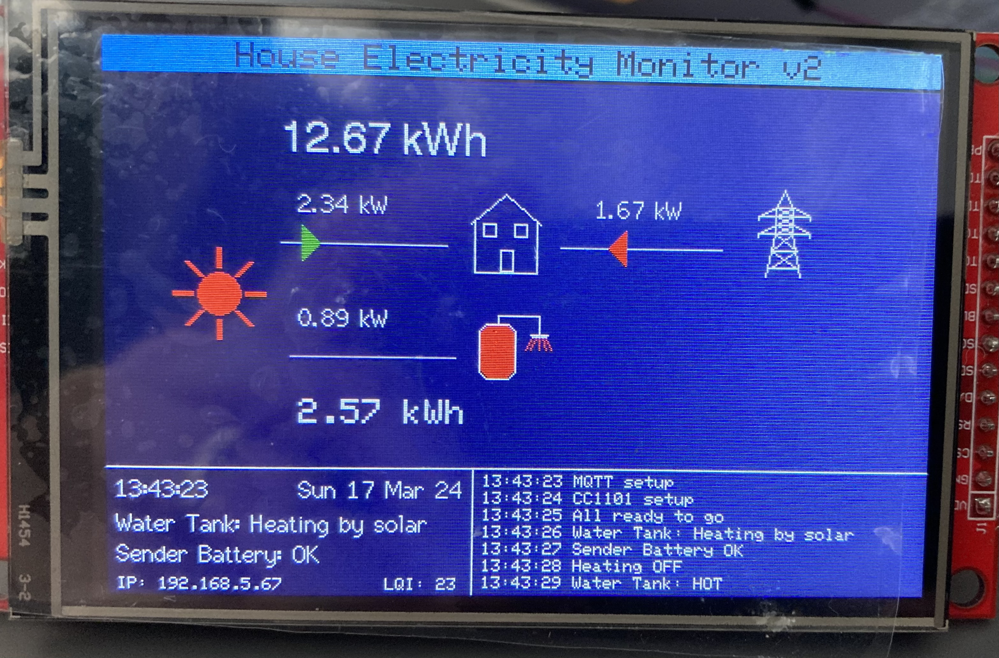

Currently in development/testing 

Test of TFT_eSPI library using an LCD TFT SPI screen (480*320) and ESP32.

Drawings / animations are for development of the iBoost Monitor.

## Screen Thoughts
Working on different views and methods for the dispalying of information. Version 1 is first stab, 
white background is not the best, v2 will look at dark background, v3 will investigate if freeRTOS 
tasks for the display are needed/good idea or not.

## Wiring 

## ESP32 Wroom 32D Pinout

